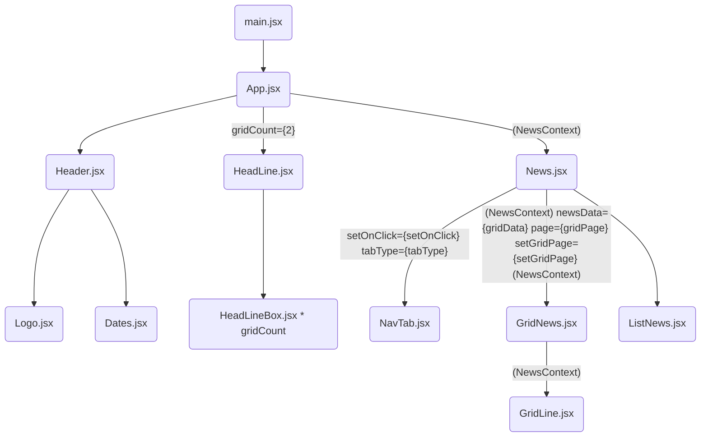

`#React` `#Vite`

## 🚀 시작하기

```bash
# Node.js 18 이상 사용 권장
$ corepack enable
# Node.js 16 이하 사용 시 corepack 전역 설치
# $ npm install -g corepack
$ yarn install

# json-server 실행
$ npx json-server ./src/json/subscribeNewsData.json

$ yarn dev
```

## 📚

<b>Component 설계</b>  
전체 기획서 분량을 모두 설계완료 하지 않는다.  
전체 구조는 방향성만 수립하고, 세부 모듈을 설계 한다.  
컴포넌트는 트리 구조를 상상하며 만들고, 이를 시각적으로 표현한다.(종이도 OK)  
지나치게 작은 컴포넌트로 나누지 않아도 된다.

<b>Component 구현 형태</b>  
기본 컴포넌트는 모두 함수 형태로 개발(Hooks API를 익히는 의미)  
객체표현이 필요한 경우는 클래스형태 사용하는 것은 허용.

<b>상태관리</b>  
상태관리를 위해서 `React useState`를 기본으로 먼저 사용해본다.  
이후 복잡한 상태의 처리를 위해 `useReducer`를 사용.  
props drilling 문제가 보이면 `Context API`를 적용해본다.

[<b>기획서</b>](https://www.figma.com/file/SJHhyw3G0A4qDSWMIo9Ths/FE_%EB%89%B4%EC%8A%A4%EC%8A%A4%ED%83%A0%EB%93%9C?type=design&node-id=11101-21659&mode=design&t=imIhUhO72MDrFOb3-0)  
[<b>디자인</b>](https://www.figma.com/file/SJHhyw3G0A4qDSWMIo9Ths/FE_%EB%89%B4%EC%8A%A4%EC%8A%A4%ED%83%A0%EB%93%9C?type=design&node-id=0%3A1&mode=design&t=5onnK2AwvpPqHvY9-1)

## 🔧 설치

📓 [json-server](https://github.com/minjeongHEO/fe-newsstand/wiki/%5BNews-Stand%5D-json%E2%80%90server-%EC%84%A4%EC%B9%98,-%EC%85%8B%ED%8C%85-%F0%9F%94%A7)

`yarn add -D sass`  
`yarn add @ant-design/icons`  
[icon](https://ant.design/components/icon#common-icon)

<br>

## 구현 내용

### ✨레이아웃 | 🔧기능

🗓 week 1

- [x] React `useState `,`useReducer`,`ContextAPI` 개념 공부
- [x] 메인화면 컴포넌트 설계
- [x] 메인화면 header - 초단위 날짜 기능 구현
- [x] 메인화면 레이아웃 그리기 - 헤드라인
- [x] 메인화면 레이아웃 그리기 - 그리드

🗓 week 2📌

- [x] 그리드 - 페이징
- [x] 그리드 - 구독
- [x] 그리드 - 구독취소

- [ ] 메인화면 레이아웃 그리기 - 리스트
- [ ] 메인화면 nav - 뉴스 롤링 기능

<br>

## 🤔 실수 및 고민 사항

~~📓 [Wiki Link (vanillaJs)](https://github.com/minjeongHEO/fe-newsstand/wiki/%5BNews-Stand%5D-%EC%8B%A4%EC%88%98,-%EA%B3%A0%EB%AF%BC-%EC%82%AC%ED%95%AD,-%EA%B0%9C%EB%85%90-%EC%A0%95%EB%A6%AC-%F0%9F%93%93)~~  
📓 [Wiki Link (React)](https://github.com/minjeongHEO/fe-newsstand-react/wiki)

<br>

[Mermaid Flowcharts - Basic Syntax](https://mermaid.js.org/syntax/flowchart.html)



    NewsContext = row={ } col={ } maxPage={ }
